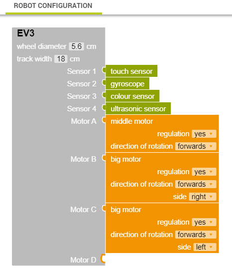
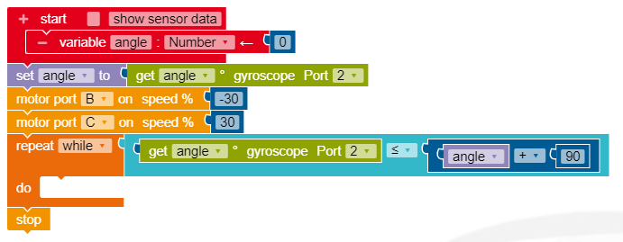

# Open Roberta tips & tricks

## Motor port vs Drive forward

There are two main ways to control the motors, individually through the "motor port" blocks, and collectively through the "drive forward" and "turn" style blocks. When to use each?

* The main difference is the motor port blocks will work instantly and won't pause your program while they occur
* Use **motor ports** when you don't know in advance how long the motor needs to drive in a given direction (such as inside a loop).
* Use **drive forward** or **turn** when you want the program to pause and complete a set distance of driving or turning before moving on.
* Don't use the **drive forward** or **turn** blocks that don't specify a set distance or turn.

## Motor port vs Set motor port

Don't get confused between "Motor port" and "Set motor port". Motor port will work the way you expect. Set motor port will not work the way you expect - don't use it (to be honest, I don't even really know what it is supposed to do - nothing very useful!).

## Adding the middle motor

If you make a claw or mechanican arm that needs the 3rd motor, go into your configuration screen to attach it to the relevant port you wired it to.

## Using different port numbers

If you get an error message when you attempt to run your program, and weird symbols appear on some of your blocks like this...

It means you have changed some of your port wiring. Go into your configuration screen and check it matches both (1) the ports you use in your program and (2) the ports you have physically wired your EV3 to the components.

## Using the gyroscope

The gyroscope is a handy way to ensure you turn accurately. Here is an example that will have you turn 90 degrees to the right.

## Turning on the spot

## Using ultrasonic to detect distances

